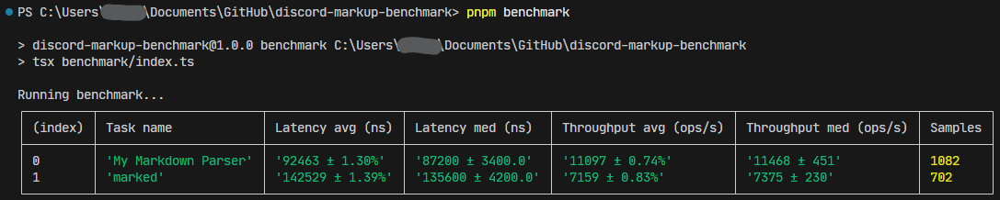

# LukeZ Discord Markup Parser Benchmark

This repository contains the benchmark for the my Markup Parser.

It compares my parser with `marked` - the most popular markdown parser in the Node.js ecosystem.

## How to use

1. Clone the repository
2. Install dependencies with `pnpm install`
3. Run the benchmark with `pnpm run benchmark`

## Results

My results were those:

## Conclusion

For my test file, the performance of my Markup Parser was better than `marked` in terms of speed and efficiency.

If you want, you can of course submit PRs to improve the benchmark or the parser itself - I'll be happy to review and merge them!

## Acknowledgements

Thanks to the authors of the libraries used in this benchmark:

- [tinybench](https://github.com/tinylibs/tinybench)
- [marked](https://github.com/markedjs/marked)
- [tsx](https://tsx.is/)
